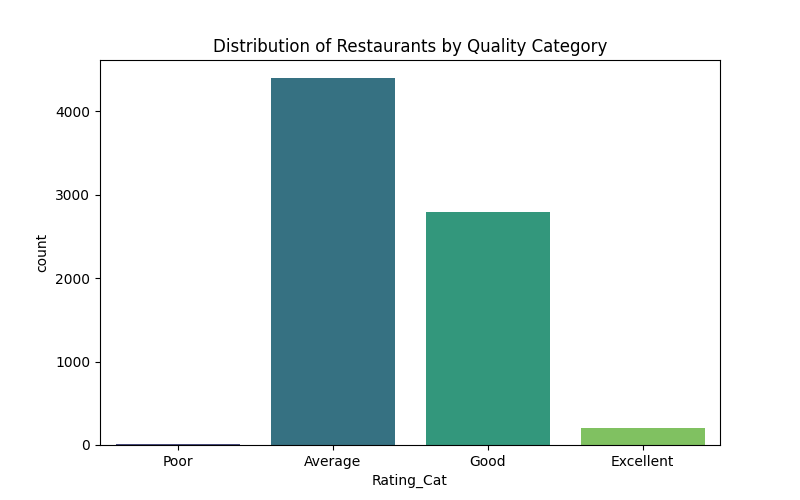
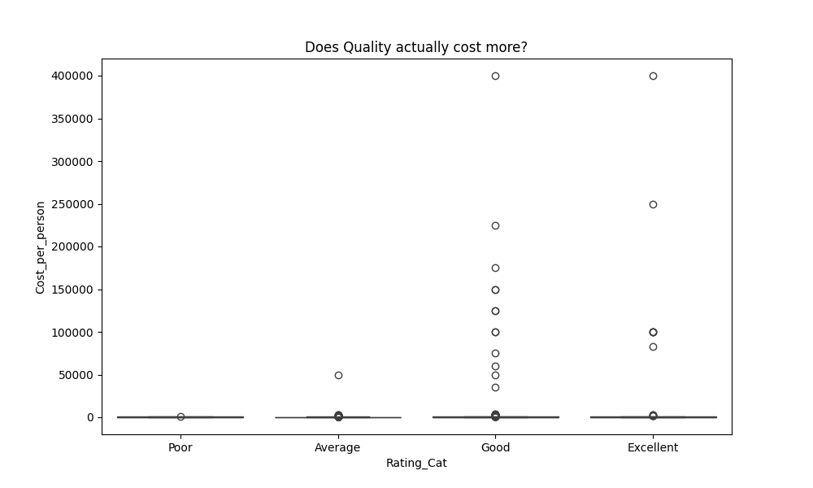
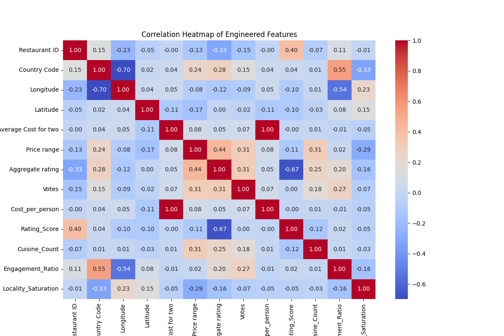

# 🍽️ Zomato Data Analysis (EDA)

## 📌 Overview

This project performs Exploratory Data Analysis (EDA) on a Zomato dataset to understand the factors influencing restaurant success, customer engagement, and pricing strategies.

---

## 🎯 Objective

To analyze restaurant data and uncover patterns related to:

* Pricing and affordability
* Customer engagement (votes)
* Ratings and quality
* Market competition

---

## 📂 Dataset Description

The dataset contains restaurant-level information including:

* Restaurant Name
* City and Locality
* Cuisines
* Average Cost for Two
* Aggregate Rating
* Votes (Customer Engagement)
* Online Delivery Availability

---

## 🧹 Data Cleaning

* Filled missing values in `Cuisines` with "Unknown"
* Replaced zero values in cost with median
* Ensured consistency in numeric columns

---

## 🔧 Feature Engineering

New features were created to extract deeper insights:

* **Cost_per_person** → Normalized pricing
* **Is_Popular** → Restaurants with above-average votes
* **Rating_Cat** → Categorized ratings (Poor → Excellent)
* **Rating_Score** → Numerical encoding of rating categories
* **Relative_Cost_Status** → Expensive vs local average
* **Cuisine_Count** → Number of cuisines offered
* **Engagement_Ratio** → Votes relative to cost
* **Locality_Saturation** → Number of restaurants in locality

---

## 📊 Key Insights

* Customer engagement (votes) is a stronger indicator of success than pricing
* High ratings are not strictly dependent on high cost
* Restaurants offering better value for money attract higher engagement
* Market competition varies across localities
* Menu diversity (multiple cuisines) may improve customer appeal

---

## 📈 Visualizations

---

## 🧠 Final Conclusion

* Restaurant success depends more on **customer engagement and experience** than pricing
* **Value-for-money restaurants** perform better than expensive ones
* **Competition level varies by locality**, affecting performance
* Feature engineering helps uncover **hidden patterns in business data**

---

## 🛠️ Tech Stack

* Python
* Pandas
* NumPy
* Matplotlib
* Seaborn

---

## 🚀 Future Improvements

* Build predictive model for restaurant success
* Create dashboard (Power BI / Tableau)
* Perform advanced segmentation

---

